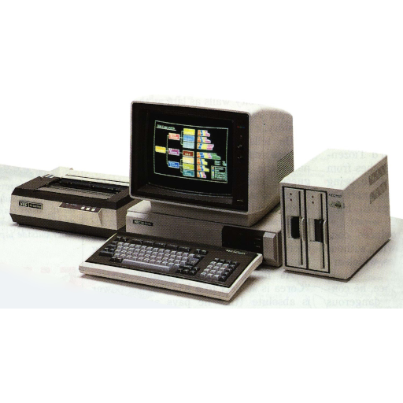

# NEC - PC-8000 / PC-8800 series (QUASI88)

### Description

QUASI88 is an emulator by Showzoh Fukunaga licensed under the BSD 3-Clause license. QUASI88 uses code from MAME, XMAME and fmgen.

### License

BSD 3-Clause and MAME non-commercial

### Icon

### Fanart

Help make me fanart!

### Screenshots

Help make me screenshots!

### Disclaimer

*Image credit: NEC Retro*
